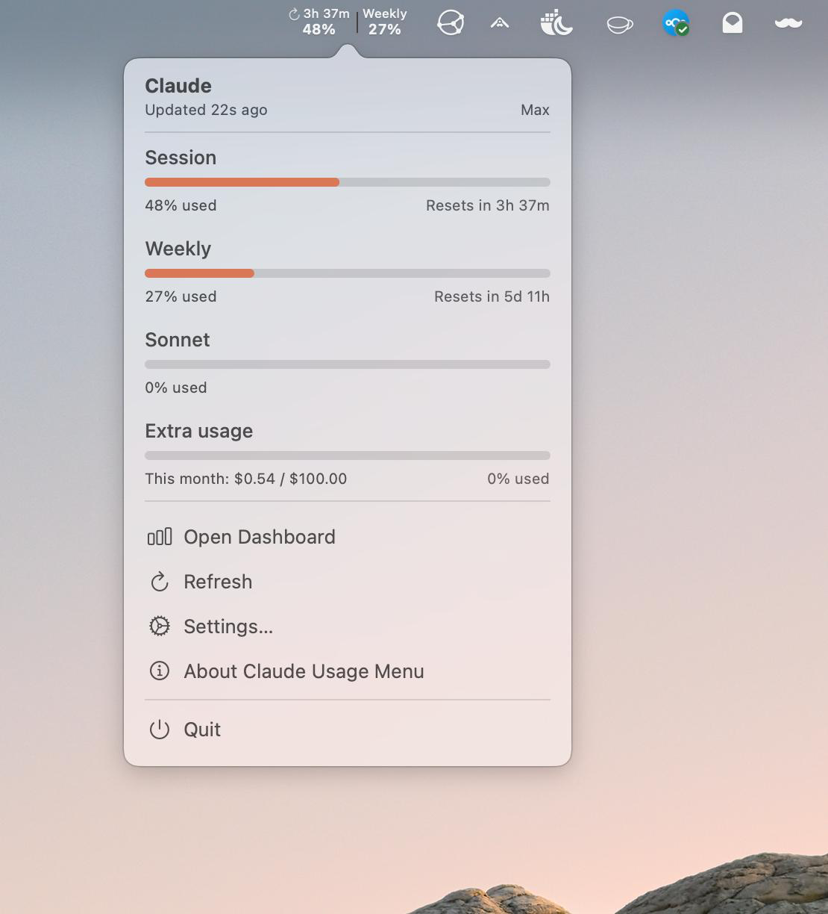

# Claude Usage Menu

A lightweight macOS menu bar app that shows your [Claude.ai](https://claude.ai) plan
usage in real time — session, weekly, Sonnet and extra-usage spend — without opening
a browser.




> **Credits / origin:** This project began as a fork of
> [`adntgv/claude-usage-systray`](https://github.com/adntgv/claude-usage-systray) by
> [@adntgv](https://github.com/adntgv). It has since been substantially rewritten and
> extended — a production-hardened SwiftUI/AppKit UI, a typed usage service with
> token-refresh and backoff, accessibility and rendering fixes, a unit-test suite, and
> automated signed + notarized releases. Thanks to the original author for the idea.

## What it shows

Mirrors the data on `claude.ai/settings/usage`:

| Metric | Description |
|--------|-------------|
| **Session** | Current session usage (resets every ~5 hours) |
| **Weekly** | Weekly all-models usage |
| **Sonnet** | Weekly Sonnet-only usage (shown in the popover) |
| **Extra usage** | Pay-as-you-go spend this month, e.g. `$0.54 / $100.00` (only when enabled on your account) |

The popover header also shows your plan (Pro/Max) and when the data was last
updated. Menu bar and popover values turn orange/red as they cross your
configured warning/critical thresholds.

## Requirements

- macOS 13 (Ventura) or newer
- [Claude Code](https://claude.ai/code) installed and logged in — the app reads its
  OAuth token from your Keychain, so there are no separate credentials to enter

## Install

### DMG (drag and drop) — recommended

1. Download the latest **`claude-usage-menu.dmg`** from the
   [Releases page](https://github.com/psimaker/claude-usage-menu/releases).
2. Open it and drag **Claude Usage Menu** onto the **Applications** folder shortcut.
3. Launch it from Applications.

The DMG is signed with a Developer ID certificate, notarized by Apple, and stapled —
so macOS opens it normally on first launch, no right-click "Open" workaround needed.

### Manual (zip)

Alternatively, download **`claude-usage-menu.zip`** from the same Releases page, unzip
it, and move **`claude-usage-menu.app`** to `/Applications`.

## Usage

The app lives in the menu bar (it has no Dock icon). Click the menu bar item to open
the popover: one section per metric (Session, Weekly, Sonnet, Extra usage), each with
a progress bar, the percentage used, and its reset countdown — followed by quick
actions: **Open Dashboard**, **Refresh**, **Settings…**, **About Claude Usage Menu**,
and **Quit**.

### Display modes

Switch **Display** in Settings → Menu Bar between:

- **Labeled (default):** a two-column layout — the session reset countdown over its
  percentage on the left, `Weekly` over its percentage on the right, each colored by
  threshold.
- **Compact:** `35% · 71%` — both percentages inline, for tight menu bars.

Both adapt to light/dark menu bars. Before the first successful fetch (or while signed
out) the values show `—` and the tooltip explains why.

### Settings

| Setting | Default | Description |
|---------|---------|-------------|
| Launch at login | Off | Start the app automatically when you log in (uses `SMAppService`) |
| Display | Labeled | Labeled two-column menu bar layout, or compact inline `35% · 71%` |
| Usage alerts | On | macOS notification when weekly usage crosses a threshold (once per period) |
| Warning threshold | 80% | Percentage above which values turn orange |
| Critical threshold | 90% | Percentage above which values turn red |

The Settings window header shows the app icon, version, and a GitHub link to this
repository.

## How it works

The app reads your Claude Code OAuth token from the macOS Keychain
(`Claude Code-credentials`) and calls the same internal endpoint that powers
`claude.ai/settings/usage`:

```
GET https://api.anthropic.com/api/oauth/usage
Authorization: Bearer <oauth_token>
anthropic-beta: oauth-2025-04-20
```

The same response carries the extra-usage block (amounts in cents, converted for
display); the plan badge (Pro/Max) is read from the same Keychain credential as the
token.

The credential is read through the `security` CLI (`/usr/bin/security
find-generic-password`) — the same binary Claude Code itself uses to write it — so the
read keeps working across Claude Code's periodic (~8h) token rotation without any
macOS Keychain prompt. If that read ever fails, the app falls back to a direct
Security.framework read, which may ask for Keychain access once ("Always Allow").

The token is cached in memory until shortly before it expires, then re-read
automatically — and also re-read if a request comes back unauthorized — so a token
Claude Code has refreshed is picked up without restarting the app. Requests use a 30s
timeout and back off on rate limits and transient errors.

> **Note:** This endpoint is undocumented and may change. It requires Claude Code to be
> installed and logged in.

## Build from source

The Xcode project is generated by [XcodeGen](https://github.com/yonaskolb/XcodeGen)
from [`project.yml`](claude-usage-menu/project.yml), and the generated
`claude-usage-menu.xcodeproj` is committed, so you can build straight away:

```bash
git clone https://github.com/psimaker/claude-usage-menu
cd claude-usage-menu/claude-usage-menu
xcodebuild -scheme claude-usage-menu -configuration Release build
open ~/Library/Developer/Xcode/DerivedData/claude-usage-menu-*/Build/Products/Release/claude-usage-menu.app
```

Or open `claude-usage-menu.xcodeproj` in Xcode and run with ⌘R.

If you change `project.yml`, regenerate the project before building:

```bash
brew install xcodegen
xcodegen generate --spec claude-usage-menu/project.yml
```

## Running tests

```bash
cd claude-usage-menu
xcodebuild test \
  -project claude-usage-menu.xcodeproj \
  -scheme claude-usage-menu \
  -destination 'platform=macOS'
```

The test bundle is wired into the `claude-usage-menu` scheme's Test action, so the same
scheme builds the app and runs the tests. CI runs this on every push and pull request
(see [`.github/workflows/ci.yml`](.github/workflows/ci.yml)).

## Releases

Releases are fully automated. Pushing a `v*` tag triggers
[`.github/workflows/release.yml`](.github/workflows/release.yml), which on a macOS
runner:

1. Builds and archives the app, signed with a **Developer ID Application** certificate.
2. Notarizes and staples the app.
3. Builds a drag-and-drop **DMG** (app + `Applications` shortcut), signs it, notarizes
   and staples it.
4. Attaches `claude-usage-menu.dmg` and `claude-usage-menu.zip` to a GitHub Release.

Cutting a new release:

```bash
git tag v1.1.0
git push origin v1.1.0
```

Signing/notarization rely on these repository secrets: `APPLE_CERTIFICATE`,
`APPLE_CERTIFICATE_PASSWORD`, `APPLE_ID`, `APPLE_TEAM_ID`, and `APPLE_APP_PASSWORD`.

## License

Released under the [MIT License](LICENSE) © Umut Erdem (psimaker).

This project began as a fork of
[`adntgv/claude-usage-systray`](https://github.com/adntgv/claude-usage-systray), which
does not carry its own license. The MIT license here covers this project's own code and
contributions; credit for the original idea goes to [@adntgv](https://github.com/adntgv).
